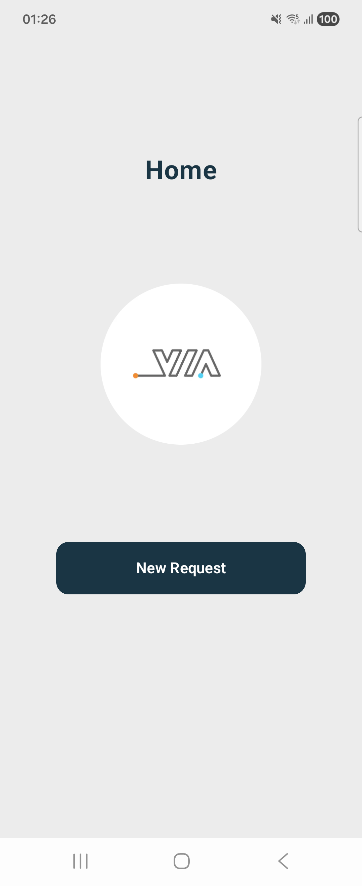
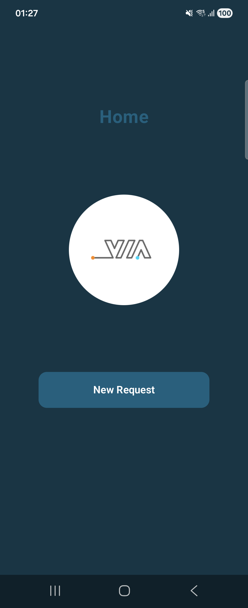

# ApprovalApp

An Android application for managing approval requests, built with a modular, scalable architecture using Jetpack Compose, Hilt, and Kotlin-first tooling.

## Preview

| Light Mode | Dark Mode |
|---|---|
|  |  |

### Approve / Reject Demo

https://github.com/user-attachments/assets/ApproveReject.mp4

---

## Tech Stack

| Layer | Technology |
|---|---|
| Language | Kotlin 2.3.20 |
| UI | Jetpack Compose (BOM 2025.12.00) + Material 3 |
| DI | Hilt 2.59.2 |
| Navigation | Jetpack Navigation Compose 2.9.7 (type-safe) |
| Networking | Retrofit 3.0.0 + OkHttp + Gson |
| Serialization | Kotlinx Serialization JSON 1.11.0 |
| Async | Kotlin Coroutines + Flow |
| Image Loading | Compose `Image` + `painterResource` |
| Logging | Timber |
| Testing | JUnit 4 + kotlinx-coroutines-test 1.10.1 + MockK 1.13.17 |
| Build | AGP 9.1.1, Gradle Convention Plugins, KSP |

---

## Project Structure

```
ApprovalApp/
├── app/                            # Application entry point
│   └── src/main/java/
│       ├── MainApp.kt              # Hilt application class
│       ├── navigation/AppNavHost   # Root nav host (multi-graph wiring)
│       └── ui/MainActivity.kt      # Single activity, AppTheme + edge-to-edge
│
├── build-logic/                    # Custom Gradle convention plugins
│   └── convention/src/main/java/
│       ├── config/                 # Android & Compose configuration
│       ├── plugin/                 # Base plugins (Android, Compose, Hilt)
│       └── plugin/module/          # Module-type plugins
│
├── core/
│   ├── common/                     # Shared infrastructure
│   │   ├── base/                   # BaseViewModel, BaseRepository, BaseScreen
│   │   ├── ui/component/           # AppTopBar, AppSlideButton
│   │   ├── ui/theme/               # AppTheme, Color, Typography, Dimens
│   │   └── utils/                  # ActivityUtil, ClickUtil, ApiState, UiState
│   ├── data/                       # Data layer
│   │   ├── di/DataModule.kt        # Hilt bindings for repository
│   │   ├── model/entity/           # ProcessEntity, RequestEntity
│   │   ├── model/response/         # ProcessDataResponse, RequestDataResponse
│   │   ├── repository/             # RequestRepository interface + Impl
│   │   └── source/remote/          # ApiService (simulated with delay + random failure)
│   └── navigation/                 # Type-safe navigation
│       ├── base/BaseNavGraph.kt    # NavGraphBuilder contract
│       ├── helper/NavHelper.kt     # composableScreen, setBackPressedWithArgs, getArgsWhenBackPressed
│       └── helper/RequestGraph.kt  # Sealed route definitions
│
├── feature/
│   └── request/
│       ├── src/main/
│       │   ├── di/                 # RequestNavModule (multi-bind nav graph)
│       │   ├── navigation/         # RequestNavGraphImpl
│       │   └── screen/
│       │       ├── landing/        # RequestLandingScreen
│       │       └── detail/         # RequestDetailScreen + ViewModel + State
│       └── src/test/
│           └── screen/detail/
│               └── RequestDetailViewModelTest.kt
│
└── assets/                         # Media for documentation
    ├── LightMode.png
    ├── DarkMode.png
    └── ApproveReject.mp4
```

---

## Modules

### `:app`
Entry point. Wires `AppTheme`, `MainActivity`, and the multi-bound `Set<BaseNavGraph>` into a single `NavHost`. Enables edge-to-edge display.

### `:core:common`
Shared infrastructure consumed by all feature modules:
- **Base classes** — `BaseViewModel` (with injectable `ioDispatcher` for testability), `BaseRepository`, `BaseScreen`
- **State management** — `ApiState<T>` (Loading / Success / Error) mapped to `UiState<T>` (Initial / Loading / Success / Failed) via `collectApiAsUiState()`
- **UI components** — `AppTopBar`, `AppSlideButton`
- **Theme** — `AppTheme` with full dark/light `ColorScheme`, `Typography`, `Dimens`

### `:core:data`
Data layer:
- `ApiService` — simulated async API with configurable delay and random 50% failure
- `RequestRepository` / `RequestRepositoryImpl` — wraps API calls as `Flow<ApiState<T>>`
- Data models: `RequestEntity`, `ProcessEntity`, response DTOs

### `:core:navigation`
Type-safe navigation infrastructure:
- `RequestGraph` — sealed class of typed routes (`RequestLandingRoute`, `RequestDetailRoute`)
- `NavHelper` — `composableScreen<T>`, `setBackPressedWithArgs`, `getArgsWhenBackPressed` for result passing between screens

### `:feature:request`
Request approval flow:
- `RequestLandingScreen` — home screen, displays logo, navigates to detail, shows result snackbar
- `RequestDetailScreen` — displays request info, Approve / Reject slide buttons, loading + error states
- `RequestDetailViewModel` — calls `approveRequest` / `rejectRequest` via repository

---

## Architecture

The project follows **MVI / Unidirectional Data Flow**:

```
UI (Compose Screen)
  └── collectAsState / LaunchedEffect
        └── ViewModel (BaseViewModel)
              └── collectApiAsUiState()
                    └── Repository (RequestRepository)
                          └── ApiService (Remote Data Source)
```

State flows upward as `Flow<ApiState<T>>`, mapped to `UiState<T>` inside `collectApiAsUiState`. Navigation results (approve/reject outcome) are passed back to the landing screen via `SavedStateHandle` using `setBackPressedWithArgs` / `getArgsWhenBackPressed`.

---

## Convention Plugins

| Plugin ID | Purpose |
|---|---|
| `convention.application` | App module: Android + Compose + Hilt |
| `convention.android.library` | Base Android library config |
| `convention.compose.library` | Compose compiler + dependencies |
| `convention.hilt` | Hilt + KSP wiring |
| `convention.feature` | Feature module: lib + Compose + Navigation + core modules + test deps |
| `convention.data` | Data module: Android lib + Retrofit + Serialization |
| `convention.navigation` | Navigation: Serialization + Parcelize + Navigation Compose |
| `convention.common` | Common module |

---

## Unit Tests

Tests live in `feature/request/src/test/` and cover `RequestDetailViewModel`.

### Strategy

| Concern | Approach |
|---|---|
| Dispatcher | `BaseViewModel.ioDispatcher` replaced with `UnconfinedTestDispatcher` in tests |
| Coroutines | `runTest` + `advanceUntilIdle()` for deterministic scheduling |
| Repository | Anonymous `RequestRepository` stub — no mocking library needed for flows |
| SavedStateHandle | MockK `relaxed = true` (args are lazy, unused in these tests) |
| StateFlow conflation | `delay(1)` between `Loading` and `Success` emissions so the collector observes both |

### Test Cases

| Test | Verifies |
|---|---|
| `Success getRequest` | `requestState` transitions Loading → Success with correct entity |
| `Error getRequest` | `requestState` reaches Failed with correct throwable message |
| `Success approveRequest` | `processState` transitions Loading → Success with correct entity |
| `Error approveRequest` | `processState` reaches Failed with correct error message |
| `Success rejectRequest` | `processState` transitions Loading → Success with correct entity |
| `Error rejectRequest` | `processState` reaches Failed with correct error message |

### Running Tests

```bash
./gradlew :feature:request:test
```

---

## Bonus

### Dark Mode

Dark mode is supported via `AppTheme`, which observes `isSystemInDarkTheme()` and switches between two full `ColorScheme` definitions:

```kotlin
private val DarkColorScheme = darkColorScheme(
    primary = NavyLight,       // 0xFF2A5F7C — lighter navy for dark backgrounds
    secondary = NavyMedium,
    background = NavyDark,
    surface = SurfaceDark,
    onPrimary = TextOnDark
)

private val LightColorScheme = lightColorScheme(
    primary = NavyDark,
    secondary = NavyMedium,
    background = BackgroundLight,
    surface = SurfaceLight,
    onPrimary = TextOnDark
)
```

Dynamic color (Material You) is intentionally disabled (`dynamicColor = false`) to preserve the app's branded navy palette across all devices.

Toggle dark mode via **System Settings → Display → Dark theme**.

### Landscape Orientation

The app uses `fillMaxSize` + `verticalScroll` on the detail screen, and `Arrangement.SpaceEvenly` on the landing screen, so both screens reflow naturally in landscape without explicit orientation handling. Edge-to-edge is enabled (`enableEdgeToEdge()`) so system bars don't clip content in either orientation.

No orientation lock is applied in the manifest — the app supports free rotation.

---

## Requirements

- Android Studio Meerkat or later
- JDK 17+
- Android SDK — min API 26, target API 36

## Getting Started

1. Clone the repository:
   ```bash
   git clone https://github.com/mirzaukasyah/ApprovalApp.git
   ```
2. Open in Android Studio.
3. Sync Gradle and run on a device or emulator (API 26+).
